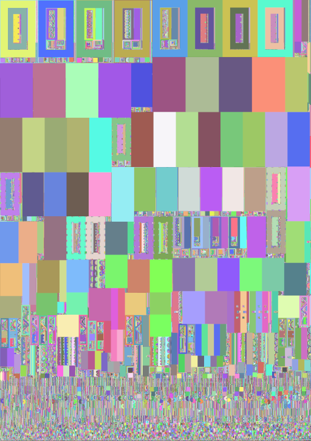

Work in progress implementation of the lightmap atlas packing method from https://media.contentapi.ea.com/content/dam/eacom/frostbite/files/gdc2018-precomputedgiobalilluminationinfrostbite.pdf.

Single-threaded, but very fast. Uses bitmasks in uint64_t chunks.

Capable of packing 4 instances of Sponza to 4096x5806 in 13.69 seconds.

